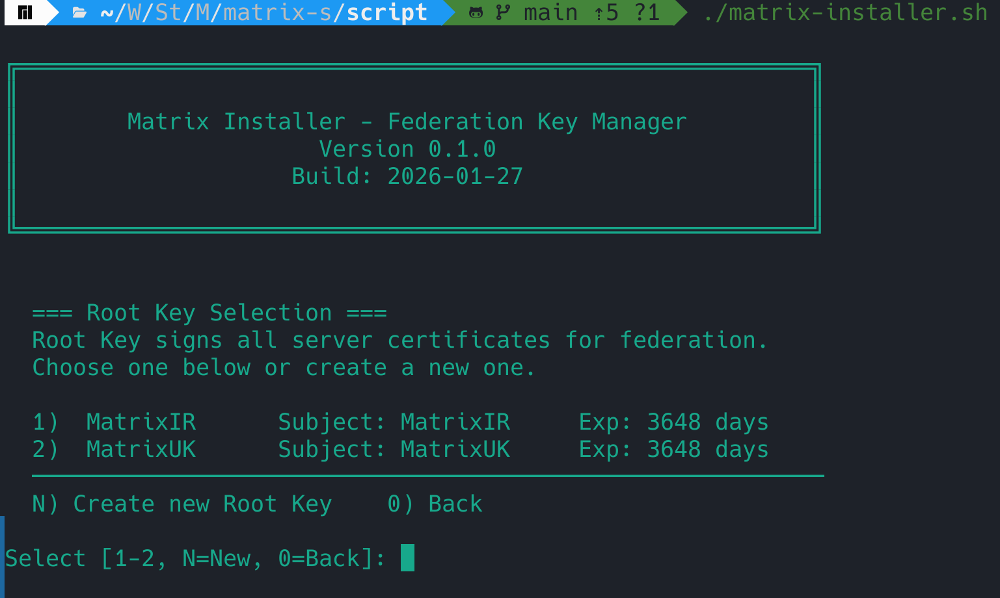
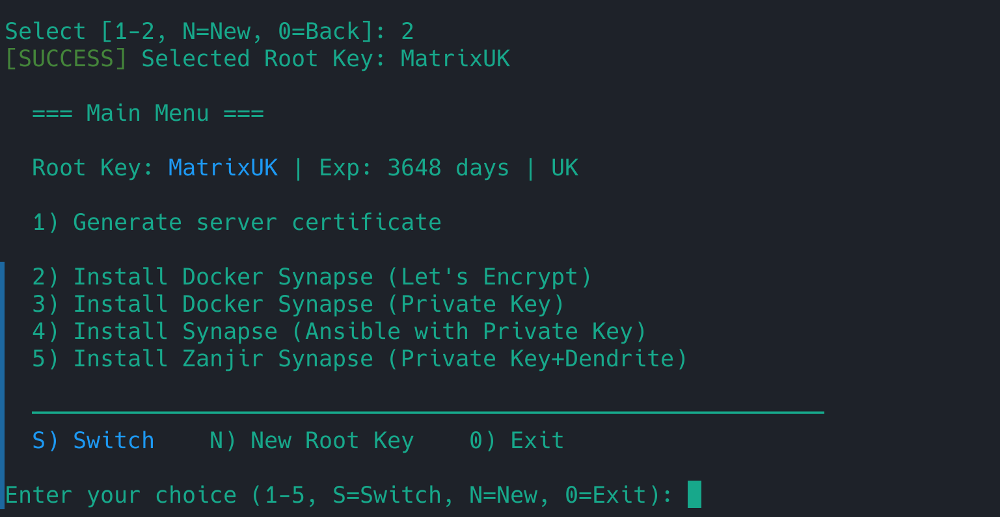

# Matrix Installer

A modular installer for Matrix homeservers with private SSL certificate management.

## What is Matrix Installer?

Matrix Installer simplifies setting up your own Matrix homeserver by handling the complicated part—SSL certificates. Matrix servers need certificates to communicate securely (this is called "federation"), but getting certificates from commercial authorities is complex and expensive.

Matrix Installer lets you become your own certificate authority. You create a Root Key once, then generate certificates for as many servers as you want. Servers with certificates from the same Root Key automatically trust each other—no configuration needed.

## Why Use It?

- **Works with IP addresses** — No domain name required (perfect for private networks)
- **Federation out of the box** — Multiple servers connect automatically with same Root Key
- **Modular addons** — Choose how to install: Docker, Ansible, or write your own
- **Standalone capable** — Script manages certificates alone; addons are optional

## Quick Start

```bash
git clone https://github.com/Amm1rr/matrix-installer
cd matrix-installer/
./matrix-installer.sh
```

That's it. Follow the prompts.

## What It Does

- **Root Key Management** — Create your own Certificate Authority
- **Server Certificates** — Generate signed certs for each server
- **Modular Addons** — Choose how to install (Docker, Ansible, etc.)
- **Federation Ready** — Same Root Key = automatic trust between servers

## How It Works

```
1. Create Root Key
2. Generate Server Certificate
3. Pick an Addon → Matrix installed
```

## Screenshots

### Root Key Selection

<p align="center">
  
</p>

### Main Menu

<p align="center">
  
</p>

## Project Structure

```
matrix-installer/
├── matrix-installer.sh     # Main script
├── addons/                 # Installation modules (optional)
└── docs/                   # Documentation
```

**Key**: Script works standalone. Addons are optional.

## Documentation

- [User Guide](docs/01-start/USER_GUIDE.md) — Complete guide
- [Quick Reference](docs/01-start/QUICK_REFERENCE.md) — Cheat sheet
- [Addon Development](docs/02-develop/ADDON_DEVELOPMENT_GUIDE.md) — Create addons

## Requirements

- Bash 4+
- OpenSSL
- (Addons may have additional requirements)

## License

MIT
